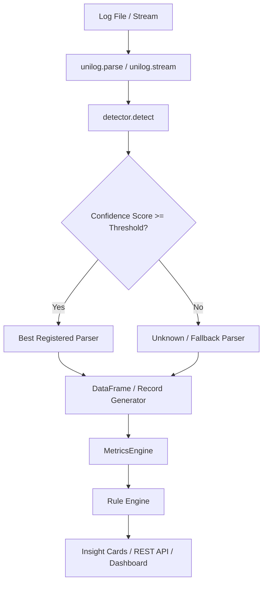
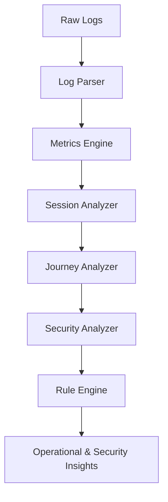
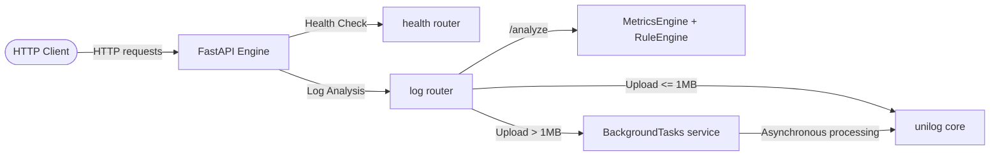

# unilog — Universal Log Parser & Analytics Platform

Parse any log file into a clean pandas DataFrame, compile rich operational metrics, reconstruct user sessions, map conversion funnels, and detect security threats — all with zero configuration.

[](https://github.com/Asterioxer/unilog/actions/workflows/ci.yml)

## Features

- **Zero Configuration**: Simply call `unilog.parse("any.log")`.
- **Auto-Detection**: Dynamically detects formats based on heuristics, regex, and confidence scoring.
- **Streaming Parser**: Stream lines lazily without loading everything into memory via `unilog.stream("any.log")`.
- **Pluggable Architecture**: Register custom formats and statistics analyzers at runtime.
- **Analytics Pipeline**: Parse → Metrics → Sessions → Journeys → Security Analyzer → Rule Engine → Insights.
- **Rule Engine**: 12 built-in rules across 4 categories — performance, reliability, traffic, and security.
- **Insight Cards**: Browser-rendered insight cards with severity, description, confidence, and recommendations.
- **Session & Security Observer**: Interactive frontend panels for behavioral session analytics and security threat detection.
- **AI SRE Assistant**: Interactive LLM diagnostic engine explaining anomalies and presenting copyable remediation configs.
- **Live Monitor**: Direct WebSocket log streaming for real-time terminal output with interval speed control.
- **Rich CLI**: Pretty output format choices including JSON, CSV, and Tables.
- **REST API**: FastAPI backend with full Swagger docs, background task support, and rate limiting.
- **React Dashboard**: Upload logs via drag-and-drop, inspect metrics, view insight cards, session analytics, and security intelligence in a modern SPA.
- **Fully Typed & Tested**: High test coverage (≥92%), complete type hinting, and robust CI/CD.

## Architecture



## Analytics Pipeline

`unilog` features a full log intelligence pipeline from raw bytes to actionable security insights:



### Log Intelligence Maturity

| Release | Capability | What It Adds |
| :---: | :--- | :--- |
| v0.1 | Parse | Zero-config format detection and DataFrame extraction |
| v0.2 | Understand | Latency percentiles, status distribution, traffic burst metrics |
| v0.3 | Secure Pipeline | Decompression bomb protection, rate limiting, proxy-aware IP resolution |
| v0.4 | Rule Engine | 12 built-in rules across 4 categories, triggered Insight objects |
| v0.5 | Insight Cards | Frontend Insight Card components, backend-driven analytics, `POST /api/v1/analyze` |
| v0.6 | Session Analytics | Session reconstruction, bounce rate, journey funnel conversion, SessionObserver UI |
| v0.7 | Security Intelligence | Dedicated SecurityAnalyzer, SecurityObserver UI panel with threat profiles |
| v0.8 | AI Diagnostics | AI SRE Assistant generating root-cause reports and remediation configs |
| v0.9 | Live Stream | Real-time WebSocket log streaming and interactive terminal monitor |

### Built-in Analyzers

All analyzers are auto-registered and run in dependency order by the `MetricsEngine`:

| Analyzer | Module | What It Produces |
| :--- | :--- | :--- |
| `StatusAnalyzer` | `modules/status.py` | HTTP status code distribution, 2xx/4xx/5xx rates |
| `LatencyAnalyzer` | `modules/latency.py` | p50, p95, p99 latency in milliseconds |
| `TrafficAnalyzer` | `modules/traffic.py` | Requests per minute, hourly breakdown |
| `EndpointAnalyzer` | `modules/endpoint.py` | Top endpoints by request count, top endpoint share |
| `BandwidthAnalyzer` | `modules/bandwidth.py` | Total bytes, bytes per second throughput |
| `BurstAnalyzer` | `modules/burst.py` | Traffic burst detection, peak window |
| `ErrorAnalyzer` | `modules/error.py` | Error ratio, top error-generating IPs |
| `DistributionAnalyzer` | `modules/distribution.py` | Method and status code breakdown |
| `SessionAnalyzer` | `modules/session.py` | Session reconstruction, bounce rate, avg session duration |
| `JourneyAnalyzer` | `modules/journey.py` | Landing → Products → Product → Cart → Checkout funnel conversion |
| `SecurityAnalyzer` | `modules/security_analyzer.py` | Brute force, enumeration, bot fingerprints, probes, injections |

### Built-in Rule Engine

Rules are evaluated against the `MetricsBundle` output and generate typed `Insight` objects:

**Performance Rules**
- `high-latency-p99` — P99 latency > 500ms (`high`)
- `high-latency-p95` — P95 latency > 300ms (`medium`)

**Reliability Rules**
- `high-error-ratio` — Error ratio > 5% (`high`)
- `high-5xx-rate` — HTTP 5xx rate > 2% (`critical`)

**Traffic Rules**
- `traffic-burst` — Traffic burst anomaly detected (`medium`)
- `bandwidth-spike` — Bandwidth throughput > 10 KB/s (`medium`)
- `endpoint-overload` — Single endpoint > 50% of total traffic (`medium`)

**Security Rules**
- `sec-bot-01` — Headless browser fingerprints detected (`high`)
- `sec-cs-02` — Credential stuffing / lockout candidates identified (`critical`)
- `sec-enum-03` — 404 error ratio > 10% (directory enumeration) (`high`)
- `sec-scan-04` — Probe hits on `.env`, `wp-admin`, `.git`, etc. (`high`)
- `sec-inj-05` — SQL injection payload signatures in request URIs (`critical`)
- `sec-inj-06` — XSS payload signatures in request URIs (`critical`)
- `sec-inj-07` — Path traversal escape sequences detected (`critical`)

## Supported Formats

| Format | Auto-detected | Primary Fields Extracted |
| :--- | :---: | :--- |
| Nginx access (combined) | ✅ | `source_ip`, `timestamp`, `method`, `path`, `status_code`, `size`, `user_agent` |
| Apache access (combined) | ✅ | `source_ip`, `timestamp`, `method`, `path`, `status_code`, `size`, `user_agent` |
| Syslog RFC 3164 | ✅ | `timestamp`, `hostname`, `process`, `pid`, `message` |
| Syslog RFC 5424 | ✅ | `timestamp`, `hostname`, `app`, `msgid`, `message` |
| JSON logs | ✅ | All keys mapped as columns, dynamic structure flattening |
| Django/Python logging | ✅ | `timestamp`, `level`, `logger`, `message` |
| Windows Event Log (XML & CSV) | ✅ | `timestamp`, `level`, `source`, `event_id`, `category`, `message` |
| Custom (user-defined) | Manual | Named capture groups from custom regex |

## Installation

Requires **Python 3.10 or higher**.

```bash
pip install unilog
```

## Quick Start

```python
import unilog

# Auto-detect format and parse to a pandas DataFrame
df = unilog.parse("access.log")
print(df.head())
```

## Streaming Example

For large files, read records lazily line-by-line:

```python
import unilog

for record in unilog.stream("huge_production.log"):
    if record.get("_parse_error"):
        print(f"Malformed: {record['raw']}")
    else:
        print(f"Valid log from: {record.get('source_ip')}")
```

## Analytics Pipeline Example

Run the full analytics + rule engine pipeline programmatically:

```python
import unilog
from unilog.analytics import MetricsEngine, AnalyzerContext
from unilog.analytics.rules import RuleEngine
from unilog.analytics.rules.builtin import collect_all_rules
from unilog.analytics.rules.models import RuleSet, RuleContext
from datetime import datetime, timezone

# Parse into records
records = list(unilog.stream("access.log"))

# Compile all metrics (sessions, journeys, security included)
context = AnalyzerContext(window_minutes=60)
engine = MetricsEngine()
result = engine.compile(records, context=context)

# Evaluate built-in rules to generate insights
ruleset = RuleSet(rules=collect_all_rules())
rule_context = RuleContext(
    timestamp=datetime.now(timezone.utc),
    window_minutes=60,
    analyzed_records=result.metadata.analyzed_records,
    skipped_records=result.metadata.skipped_records,
)
insights = RuleEngine().evaluate(
    bundle=result.metrics,
    ruleset=ruleset,
    context=rule_context,
)

for insight in insights:
    print(f"[{insight.severity.upper()}] {insight.description}")
    print(f"  → {insight.recommendation}")
```

## Statistics Plugin Example

Create a custom statistics plugin to compute metrics on parsed logs:

```python
import pandas as pd
from unilog.stats import StatsPlugin, aggregate_stats

class MySecurityMetrics(StatsPlugin):
    def compute(self, df: pd.DataFrame) -> dict:
        # Count requests to administrative endpoints
        if "path" not in df.columns:
            return {"admin_requests": 0}
        admins = df["path"].str.contains("/admin|/wp-admin", na=False).sum()
        return {"admin_requests": int(admins)}

# Running stats on any log automatically runs all registered plugins
summary = unilog.stats("access.log")
print(f"Admin Access Attempts: {summary.get('admin_requests')}")
```

## Custom Parser Registration

Register custom regex-based patterns at runtime:

```python
import unilog

# Register a custom format named 'myapp' matching standard pattern
unilog.register_format(
    name="myapp",
    pattern=r"^(?P<timestamp>\d{4}-\d{2}-\d{2} \d{2}:\d{2}:\d{2}) \[(?P<level>[A-Z]+)\] (?P<message>.*)$",
    timestamp_field="timestamp",
    timestamp_format="%Y-%m-%d %H:%M:%S"
)

# Parsers will now auto-detect and parse 'myapp' logs
df = unilog.parse("app.log")
```

## CLI Examples

The CLI provides commands to inspect logs immediately from the shell:

```bash
# List all registered parser formats
unilog formats

# Detect a log format and see confidence score rankings
unilog detect access.log

# Compute aggregate statistics on a log file
unilog stats access.log

# Parse logs and output in a pretty formatted table (or csv/json)
unilog parse access.log --output table --head 10
unilog parse access.log --output json --chunksize 1000
```

## REST API Platform

`unilog` includes a complete FastAPI-based REST API backend to power web clients and remote scripts.

### Running the API

You can launch the REST API directly using `uvicorn`:

```bash
uv run uvicorn api.app:app --host 0.0.0.0 --port 8000 --reload
```

Or run via Docker:

```bash
docker-compose up --build
```

Access the interactive OpenAPI Swagger UI at `http://localhost:8000/docs`.

### API Endpoints

**Health**
- `GET /health` - General status of the REST service.
- `GET /live` - Liveness health check status (Kubernetes standard).
- `GET /ready` - Readiness health check status (Kubernetes standard).

**Log Analysis**
- `POST /api/v1/parse` - Parse raw log text payload into structured records.
- `POST /api/v1/detect` - Detect format with ranked confidence scores.
- `POST /api/v1/stats` - Generate summary statistics (top IPs, log levels, endpoints, bytes).
- `POST /api/v1/analyze` - **Full analytics pipeline**: parse → metrics → sessions → journeys → security → rule engine → insights. Returns `MetricsBundle` + `Insight[]`.
- `POST /api/v1/formats` - List all registered parser configurations.
- `POST /api/v1/stream` - Parse logs and stream JSON records line-by-line.
- `POST /api/v1/upload` - Upload file for parsing. Large files (>1MB) parse asynchronously and return a `task_id`.
- `GET /api/v1/tasks/{task_id}` - Retrieve progress or result of a background upload task.

**AI & Diagnostics**
- `POST /api/v1/ai/explain` - Run AI diagnostics report containing explanations and copyable configuration remediations.

**Live Stream**
- `WebSocket /api/v1/ws/live` - Start a WebSocket connection for real-time log streaming.

### API Architecture



### curl Examples

**Parse log payload:**
```bash
curl -X POST http://localhost:8000/api/v1/parse \
  -H "Content-Type: application/json" \
  -d '{"log_text": "127.0.0.1 - - [10/Jul/2026:20:53:59 +0530] \"GET /index.html HTTP/1.1\" 200 1043", "format": "nginx"}'
```

**Run full analytics pipeline:**
```bash
curl -X POST http://localhost:8000/api/v1/analyze \
  -H "Content-Type: application/json" \
  -d '{"log_text": "...", "format": "auto", "enable_rules": true, "window_minutes": 60}'
```

**Upload log file:**
```bash
curl -X POST http://localhost:8000/api/v1/upload \
  -F "file=@access.log" \
  -F "format=auto"
```

### Python requests Example

```python
import requests

# Run the full analytics pipeline with rules enabled
url = "http://localhost:8000/api/v1/analyze"
payload = {
    "log_text": open("access.log").read(),
    "format": "auto",
    "enable_rules": True,
    "window_minutes": 60,
}
response = requests.post(url, json=payload)
data = response.json()

print(f"Analyzed: {data['metadata']['analyzed_records']} records")
for insight in data["insights"]:
    print(f"[{insight['severity'].upper()}] {insight['description']}")
```

## React Dashboard

`unilog` ships with a fully-featured React + TypeScript SPA dashboard.

### Running the Frontend

```bash
cd frontend
npm install
npm run dev   # starts at http://localhost:5173
```

### Dashboard Features

- **Upload Panel**: Drag-and-drop or paste raw log text directly for instant analysis.
- **Summary Cards**: Animated metric cards for total requests, error rate, P99 latency, and bandwidth.
- **Charts**: Status code distribution, latency timeline, top endpoints, and method breakdown.
- **Logs Table**: Filterable, sortable, and keyboard-navigable log record table with column visibility toggles and CSV/JSON export.
- **Insight Cards** (`InsightCard`, `InsightCardsList`): Render rule-generated insights with severity badge, confidence meter, description, category tag, and recommendations.
- **Session Observer** (`SessionObserver`): Visualizes reconstructed user sessions, bounce rate, average session duration, and journey funnel conversion steps.
- **Security Observer** (`SecurityObserver`): Displays threat profiles for brute force, bot fingerprints, directory enumeration, vulnerability probes, and injection attempts with expandable IP-level drill-downs.
- **AI SRE Assistant** (`AIAssistant`): Generates diagnostic reports and copyable configuration remediation code blocks.
- **Live Monitor** (`LiveMonitor`): WebSocket terminal stream tracing log events in real-time.
- **Dark / Light Theme**: Persistent theme preference via `ThemeProvider`.
- **Keyboard Shortcuts**: Global keyboard shortcuts for navigation and actions.

## Security

`unilog` is hardened to securely parse untrusted log sources and handle production environments:

- **Proxy-Aware Rate Limiting**: Centralized client IP resolution supports direct socket, X-Forwarded-For, and X-Real-IP headers via `UNILOG_TRUST_PROXY` and `UNILOG_TRUSTED_PROXIES` settings.
- **Configurable CORS & CSP**: Supports dynamic domain origins and Content Security Policy custom setups via `UNILOG_CORS_ORIGINS` and `UNILOG_CSP` variables.
- **Safe Error Suppression**: Hides traceback details from clients, logging exceptions securely with request tracking context.
- **Decompression Bomb Protection**: Gzip decompressions are restricted chunk-by-chunk up to `UNILOG_MAX_DECOMPRESSED_SIZE` to prevent memory exhaustion attacks.
- **XML Entity Hardening**: Windows Event Log XML parser uses `defusedxml` to block DTD entity expansions (billion laughs).
- **Eviction Queue Tasks**: Ephemeral background parsing tasks are auto-purged based on TTL and count limits.
- **Payload Constraints**: JSON request string body lengths are validated by Pydantic models.

For more details on configuration parameters and security disclosures, see [security.md](docs/security.md) and [SECURITY.md](SECURITY.md).

## Maintainer Intelligence

`unilog` uses an automated **Maintainer Intelligence** subsystem to manage code reviews and repository health:

- **Reviewdog Static Analysis**: Inline check annotations on pull requests for Ruff, Mypy, ESLint, and TypeScript compiler errors.
- **Automated AI Reviews**: Gemini-powered PR reviews triggered after successful CI checks, evaluating changes against repository architecture, invariants, and coding standards.
- **Automated Dependabot Reviews**: Security and migration assessment for automated dependency updates.
- **Comment Caching & Triage Labeling**: Edit-in-place comments indexed by commit SHAs to prevent spam, applying `needs-review`, `tests`, or `documentation` labels automatically.
- **Maintainer Intelligence Benchmark Suite**: A manifest-driven evaluation framework located under `benchmarks/` to run regression tests and score AI reviewer accuracy.
- **Maintainer DevEx Integrations**:
  - **Release Drafter**: Automatically compiles draft release notes mapped to PR labels.
  - **Issue Forms**: Enforces structured bug report and feature request templates.
  - **Path Labeler**: Automatically tags PRs based on changed code areas (backend, frontend, docs, ci).
  - **OpenSSF Scorecard**: Scans and logs repository security metrics.
  - **Automated PR Coverage**: Posts coverage metrics tables on each pull request.

For more details on operations, configuration, and swapping LLM clients, see [maintainer-intelligence.md](docs/maintainer-intelligence.md).

## Contribution Guide

1. Clone the repository and install dependencies with `uv`:
   ```bash
   uv sync --all-extras
   ```
2. Run quality checking tools before submitting PRs:
   ```bash
   uv run ruff check .
   uv run mypy unilog api
   uv run pytest --cov=unilog --cov=api --cov-report=term-missing
   ```
3. For frontend development:
   ```bash
   cd frontend
   npm ci
   npm run test
   npm run build
   ```
4. Ensure backend coverage remains at or above 92%.
