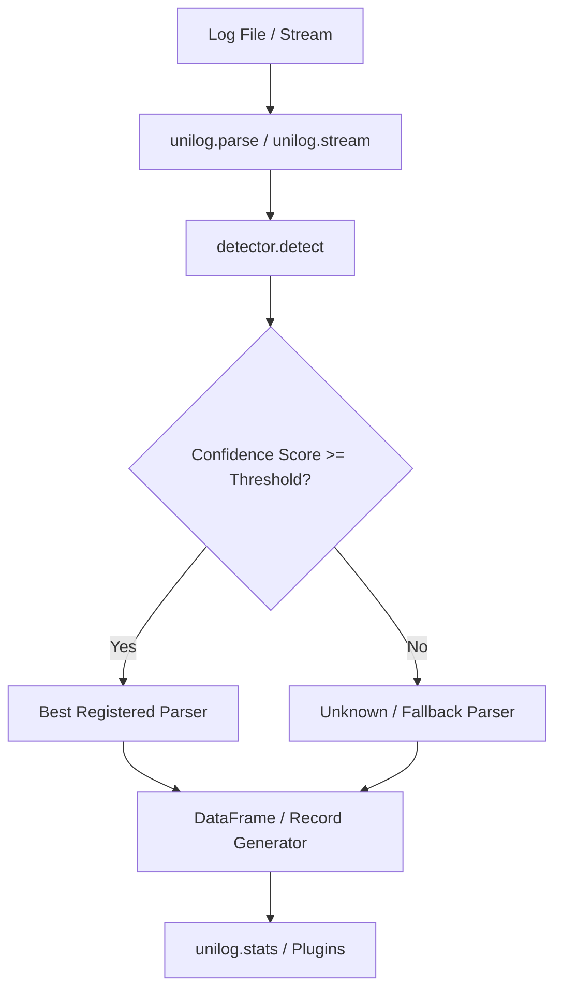
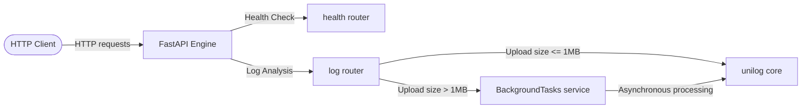

# unilog — Universal Log Parser

Parse any log file into a clean pandas DataFrame with zero configuration.

[](https://github.com/Asterioxer/unilog/actions/workflows/ci.yml)

## Features

- **Zero Configuration**: Simply call `unilog.parse("any.log")`
- **Auto-Detection**: Dynamically detects formats based on heuristics, regex, and confidence validation.
- **Streaming Parser**: Stream lines instead of loading everything to memory using `unilog.stream("any.log")`.
- **Pluggable Architecture**: Easily register custom formats and statistics analyzers.
- **Rich CLI**: Pretty output format choices including JSON, CSV, and Tables.
- **Fully Typed & Tested**: High test coverage, complete type hinting, and robust CI checking.

## Architecture



## Supported Formats

| Format | Auto-detected | Primary Fields Extracted |
| :--- | :---: | :--- |
| Nginx access (combined) | ✅ | `source_ip`, `timestamp`, `method`, `path`, `status_code`, `size`, `user_agent` |
| Apache access (combined) | ✅ | `source_ip`, `timestamp`, `method`, `path`, `status_code`, `size`, `user_agent` |
| Syslog RFC 3164 | ✅ | `timestamp`, `hostname`, `process`, `pid`, `message` |
| Syslog RFC 5424 | ✅ | `timestamp`, `hostname`, `app`, `msgid`, `message` |
| JSON logs | ✅ | All keys mapped as columns, dynamic structure flattening |
| Django/Python logging | ✅ | `timestamp`, `level`, `logger`, `message` |
| Windows Event Log (XML & CSV) | ✅ | `timestamp`, `level`, `source`, `event_id`, `category`, `message` |
| Custom (user-defined) | Manual | Named capture groups from custom regex |

## Installation

```bash
pip install unilog
```

## Quick Start

```python
import unilog

# Auto-detect format and parse to a pandas DataFrame
df = unilog.parse("access.log")
print(df.head())
```

## Streaming Example

For large files, read records lazily line-by-line:

```python
import unilog

for record in unilog.stream("huge_production.log"):
    if record.get("_parse_error"):
        print(f"Malformed: {record['raw']}")
    else:
        print(f"Valid log from: {record.get('source_ip')}")
```

## Statistics Plugin Example

Create a custom statistics plugin to compute metrics on parsed logs:

```python
import pandas as pd
from unilog.stats import StatsPlugin, aggregate_stats

class MySecurityMetrics(StatsPlugin):
    def compute(self, df: pd.DataFrame) -> dict:
        # Count requests to administrative endpoints
        if "path" not in df.columns:
            return {"admin_requests": 0}
        admins = df["path"].str.contains("/admin|/wp-admin", na=False).sum()
        return {"admin_requests": int(admins)}

# Running stats on any log automatically runs all registered plugins
summary = unilog.stats("access.log")
print(f"Admin Access Attempts: {summary.get('admin_requests')}")
```

## Custom Parser Registration

Register custom regex-based patterns at runtime:

```python
import unilog

# Register a custom format named 'myapp' matching standard pattern
unilog.register_format(
    name="myapp",
    pattern=r"^(?P<timestamp>\d{4}-\d{2}-\d{2} \d{2}:\d{2}:\d{2}) \[(?P<level>[A-Z]+)\] (?P<message>.*)$",
    timestamp_field="timestamp",
    timestamp_format="%Y-%m-%d %H:%M:%S"
)

# Parsers will now auto-detect and parse 'myapp' logs
df = unilog.parse("app.log")
```

## CLI Examples

The CLI provides commands to inspect logs immediately from the shell:

```bash
# List all registered parser formats
unilog formats

# Detect a log format and see confidence score rankings
unilog detect access.log

# Compute aggregate statistics on a log file
unilog stats access.log

# Parse logs and output in a pretty formatted table (or csv/json)
unilog parse access.log --output table --head 10
unilog parse access.log --output json --chunksize 1000
```

## REST API Platform

`unilog` includes a complete FastAPI-based REST API backend to power web clients and remote scripts.

### Running the API

You can launch the REST API directly using `uvicorn`:

```bash
uv run uvicorn api.app:app --host 0.0.0.0 --port 8000 --reload
```

Or run via Docker:

```bash
docker-compose up --build
```

Access the interactive OpenAPI Swagger UI at `http://localhost:8000/docs`.

### API Endpoints

- `GET /health` - General status of the REST service.
- `GET /live` - Liveness health check status (Kubernetes standard).
- `GET /ready` - Readiness health check status (Kubernetes standard).
- `POST /api/v1/parse` - Parse raw log text payload.
- `POST /api/v1/detect` - Detect format with confidence score list.
- `POST /api/v1/stats` - Generate metrics (Top IPs, levels, endpoints, bytes).
- `POST /api/v1/formats` - List all registered parser configurations.
- `POST /api/v1/stream` - Parse logs and stream JSON records line-by-line.
- `POST /api/v1/upload` - Upload file for parsing. Large files (>1MB) parse asynchronously in background tasks and return a `task_id`.
- `GET /api/v1/tasks/{task_id}` - Retrieve progress or result of background upload parsing.

### API Architecture



### curl Examples

**Parse log payload:**
```bash
curl -X POST http://localhost:8000/api/v1/parse \
  -H "Content-Type: application/json" \
  -d '{"log_text": "127.0.0.1 - - [10/Jul/2026:20:53:59 +0530] \"GET /index.html HTTP/1.1\" 200 1043", "format": "nginx"}'
```

**Upload log file:**
```bash
curl -X POST http://localhost:8000/api/v1/upload \
  -F "file=@access.log" \
  -F "format=auto"
```

### Python requests Example

```python
import requests

url = "http://localhost:8000/api/v1/parse"
payload = {
    "log_text": '127.0.0.1 - - [10/Jul/2026:20:53:59 +0530] "GET /index.html HTTP/1.1" 200 1043',
    "format": "auto"
}
response = requests.post(url, json=payload)
print(response.json())
```

## Contribution Guide

1. Clone the repository and install dependencies with `uv`:
   ```bash
   uv sync --all-extras
   ```
2. Run quality checking tools before submitting PRs:
   ```bash
   uv run ruff check .
   uv run mypy unilog api
   uv run pytest --cov=unilog --cov=api --cov-report=term-missing
   ```
3. Ensure coverage remains at or above 92%.
