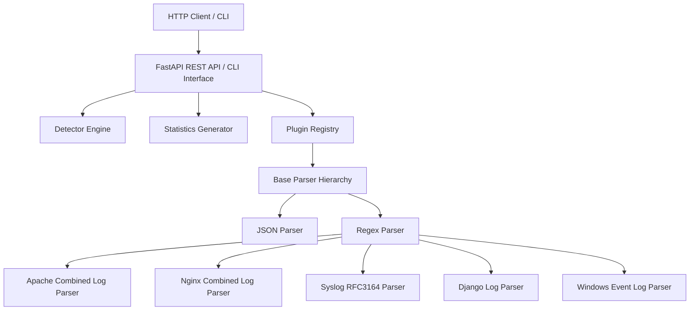

# Architecture Guide

This document describes the design and components of the `unilog` platform.

## Design Goals

- **Stream-First Processing**: Logs are read line-by-line rather than loading everything into a DataFrame first, keeping memory consumption low.
- **Auto-Detection**: The engine scores logs dynamically to auto-detect their formats.
- **Extensible Registry**: A simple decorator-based registration system allowing third-party package parsers to extend `unilog`.

## Component Overview

### 1. Plugin Registry (`unilog/registry.py`)
Maintains a registry of all active parser implementations. Built-in parsers are registered automatically, and custom parsers can register via `@register_parser` class decorators.

### 2. Detector Engine (`unilog/detector.py`)
Inspects incoming log streams, feeds samples to all registered parsers, collects confidence scores, and returns the highest scoring format.

### 3. Base Parser Hierarchy (`unilog/parsers/base.py`)
- **`BaseParser`**: Base interface prescribing streaming generator interfaces (`parse_stream`) and configuration.
- **`RegexParser`**: Extension of `BaseParser` mapping logs to regex search patterns.
- **`StructuredRegexParser`**: Standard regex parser normalizing keys like `client_ip`, `request_path`, `http_status`, and `timestamp`.

### 4. Background Job Engine (`api/services/background_tasks.py`)
Provides in-memory queueing and thread-pool execution for large uploaded log files (>1MB), preventing request timeouts.
