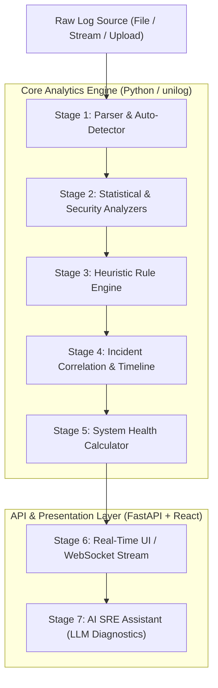

# Architecture Guide & Platform Overview

This document details the architectural design, data pipelines, component interactions, and execution flow of the `unilog` log analytics platform.

---

## 🏗️ End-to-End Processing Pipeline

The `unilog` architecture processes unstructured operational logs through a modular, 7-stage processing pipeline:

```mermaid
flowchart TD
    RawLogs["Raw Log Source (File / Stream / Upload)"] --> Stage1["Stage 1: Parser & Auto-Detector"]
    Stage1 --> Stage2["Stage 2: Statistical & Security Analyzers"]
    Stage2 --> Stage3["Stage 3: Heuristic Rule Engine"]
    Stage3 --> Stage4["Stage 4: Incident Correlation & Timeline"]
    Stage4 --> Stage5["Stage 5: System Health Calculator"]
    Stage5 --> Stage6["Stage 6: Real-Time UI / WebSocket Stream"]
    Stage6 --> Stage7["Stage 7: AI SRE Assistant (LLM Diagnostics)"]

    subgraph "Core Analytics Engine (Python / unilog)"
        Stage1
        Stage2
        Stage3
        Stage4
        Stage5
    end

    subgraph "API & Presentation Layer (FastAPI + React)"
        Stage6
        Stage7
    end
```

---

## 🧩 Component Breakdown

### 1. Parser & Auto-Detector (`unilog/parsers/` & `unilog/detector.py`)
- **Stream-First Processing**: Processes lines dynamically via Python generators without allocating large DataFrames in memory.
- **Dynamic Format Scoring**: Evaluates candidate parsers against sample log lines and ranks confidence scores.
- **Supported Formats**: Nginx, Apache Combined, Syslog RFC3164, Django, Windows Event Log, and Structured JSON.
- **Extensible Registry**: Uses `@register_parser` decorators to dynamically add new log parsers.

### 2. Analytics & Security Observers (`unilog/analytics/`)
- **Security Observer**: Detects SQL Injection (SQLi), Cross-Site Scripting (XSS), Brute Force attempts, directory traversal, and malicious user agents.
- **Session & Journey Analyzer**: Tracks user IP sessions, page traversal sequences, bounce rates, and session durations.
- **Performance Observer**: Computes response time percentiles ($p_{50}, p_{90}, p_{99}$), high-latency endpoints, and throughput metrics.
- **Operational Observer**: Aggregates HTTP status code distribution (2xx, 3xx, 4xx, 5xx), error rates, and volume per minute.

### 3. Heuristic Rule Engine (`unilog/analytics/rules.py`)
- Evaluates built-in and user-defined rules across 4 domain categories:
  - **Security**: High Brute Force, Malicious Payload Detection.
  - **Reliability**: Elevated 5xx Error Spike, Service Degradation.
  - **Performance**: High Latency $p_{99}$ Threshold Exceeded.
  - **Traffic**: Sudden Traffic Anomaly / Spike.
- Supports custom expression rules with configurable severity levels (`CRITICAL`, `HIGH`, `MEDIUM`, `LOW`).

### 4. Incident Correlation Engine (`unilog/analytics/incidents/`)
- Group related anomalies into correlated **Security & Operational Incidents**.
- Reconstructs chronological event timelines, associating raw log lines with specific incident roots.
- Assigns confidence scores based on co-occurrence windows and severity weighting.

### 5. System Health Calculator (`unilog/analytics/health.py`)
- Calculates an operational health score ($0 - 100\%$) based on:
  - **Error Rate Penalty**: Evaluates 5xx/4xx ratios against total request volume.
  - **Latency Penalty**: Evaluates $p_{95}$ latency against baseline SLAs.
  - **Security Penalty**: Deducts score for active CRITICAL/HIGH security incidents.
- Emits health status categories: `HEALTHY` ($\ge 90\%$), `DEGRADED` ($70 - 89\%$), `CRITICAL` ($< 70\%$).

### 6. Real-Time UI & WebSocket Stream (`api/routers/live.py` & `frontend/src/`)
- **FastAPI WebSocket Endpoint**: `/api/v1/ws/live` streams real-time log records to client subscribers with configurable emission intervals.
- **React 18 SPA**: Responsive SOC Dashboard built with Vite, Tailwind-style custom CSS, Recharts analytics, and accessible terminal controls.
- **Sub-Route Shell**: Dedicated pages for Parsed Logs Explorer, Custom Rules, API Reference, Settings, and Help Center.

### 7. AI SRE Assistant (`api/routers/ai.py` & `frontend/src/components/AIAssistant.tsx`)
- Integrates Google Gemini API to analyze aggregated log metrics and correlated incidents.
- Generates natural language root-cause hypotheses, severity ratings, and actionable remediation steps.

---

## ⚡ Background Async Architecture

For large log uploads (>1MB), the API offloads processing to a background task runner (`api/services/background_tasks.py`):
1. Client uploads file $\rightarrow$ API returns immediately with a `task_id` and HTTP `202 Accepted`.
2. Worker thread parses and calculates metrics asynchronously in the background.
3. Client polls `/api/v1/tasks/{task_id}` via `useTaskPoller` hook until status reaches `COMPLETED`.
